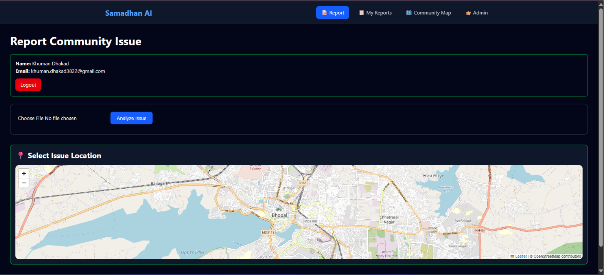
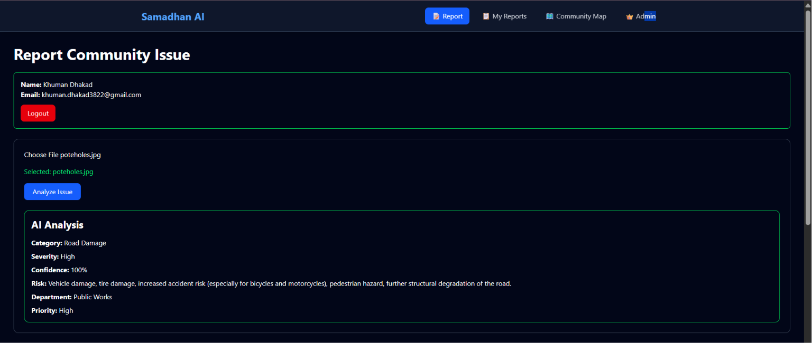
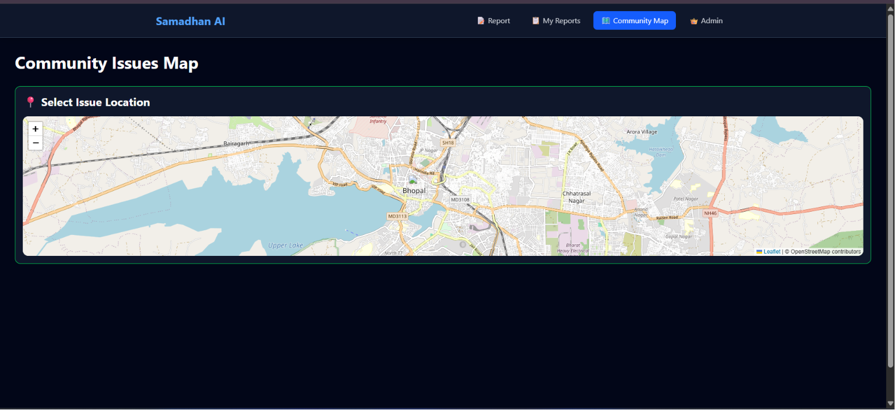
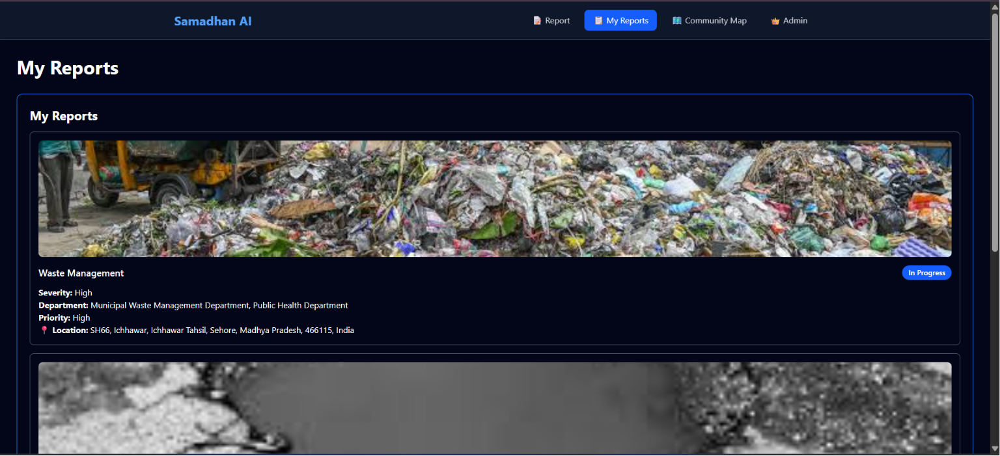
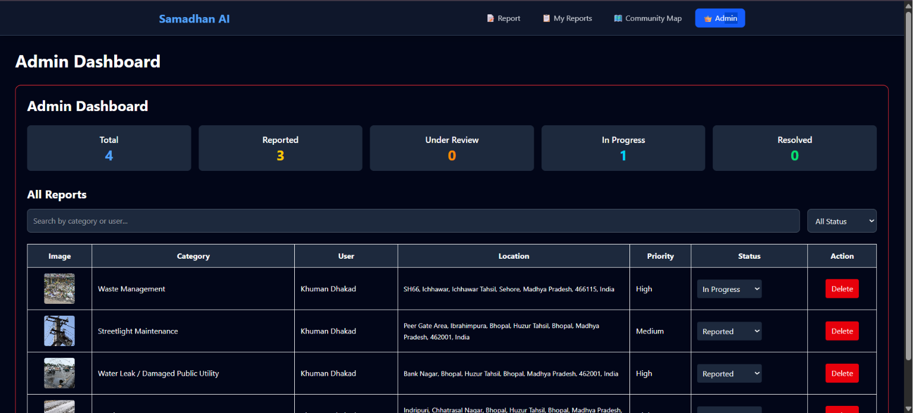

# 🚀 Samadhan AI

<div align="center">

### 🤖 AI-Powered Community Issue Reporting Platform

Built for **Coding Ninjas × Google AI Hackathon 2026**

[]()
[]()
[]()
[]()
[]()
[]()

🌐 **Live Demo**  
https://samadhan-ai-rho.vercel.app

💻 **GitHub Repository**  
https://github.com/khuman-dhakad/samadhan-ai

</div>

---

# 📖 Overview

Samadhan AI is an AI-powered civic issue reporting platform that enables citizens to report public infrastructure problems using image analysis and location intelligence.

Citizens simply upload an image, and **Google Gemini AI** automatically analyzes it, identifies the issue, assigns severity and priority, and stores the report with its exact location for transparent community monitoring.

---

# ✨ Key Features

- 🤖 AI Image Analysis using Google Gemini
- 📍 Interactive Location Selection
- 🗺 Community Issue Map
- 🔐 Google Authentication
- ☁ Cloudinary Image Storage
- 🔥 Firebase Firestore Database
- 👤 Personal Report Dashboard
- 👑 Admin Dashboard
- 📱 Responsive Interface
- ⚡ Fast React + Vite Application

---

# 🏗 System Architecture

```text
              User
                │
                ▼
      Google Authentication
                │
                ▼
         Upload Issue Image
                │
                ▼
         Google Gemini AI
                │
     Category • Severity • Priority
                │
                ▼
       Select Issue Location
                │
                ▼
      Upload Image → Cloudinary
                │
                ▼
     Store Report → Firestore
                │
       ┌────────┴────────┐
       ▼                 ▼
 Community Map      My Reports
```

---

# 🛠 Tech Stack

| Category | Technologies |
|----------|--------------|
| Frontend | React, Vite, Tailwind CSS |
| Maps | React Leaflet, OpenStreetMap |
| AI | Google Gemini AI |
| Authentication | Firebase Authentication |
| Database | Cloud Firestore |
| Image Storage | Cloudinary |
| Deployment | Vercel |

---

# 📂 Project Structure

```text
src
│
├── assets
├── components
│   ├── Navbar
│   ├── MapView
│   ├── ReportsDashboard
│   ├── MyReports
│   └── AdminDashboard
│
├── pages
│   ├── Home
│   ├── ReportIssue
│   ├── CommunityMap
│   ├── MyReports
│   └── Admin
│
├── services
│   ├── firebase
│   ├── gemini
│   ├── cloudinary
│   └── map
│
└── utils
```

---

# 📸 Screenshots

## 📝 Report Community Issue



---

## 🤖 AI Image Analysis



---

## 🗺 Community Map



---

## 📋 My Reports



---

## 👑 Admin Dashboard



---

# 🚀 Installation

```bash
git clone https://github.com/khuman-dhakad/samadhan-ai.git

cd samadhan-ai

npm install

npm run dev
```

---

# 🔐 Environment Variables

Create a `.env` file:

```env
VITE_GEMINI_API_KEY=

VITE_FIREBASE_API_KEY=
VITE_FIREBASE_AUTH_DOMAIN=
VITE_FIREBASE_PROJECT_ID=
VITE_FIREBASE_STORAGE_BUCKET=
VITE_FIREBASE_MESSAGING_SENDER_ID=
VITE_FIREBASE_APP_ID=
```

---

# 🚀 Deployment

The application is deployed on **Vercel**.

**Live URL**

https://samadhan-ai-rho.vercel.app

---

# 🔮 Future Improvements

- Authority Dashboard
- Real-time Notifications
- Report Verification Workflow
- Analytics Dashboard
- Mobile Application
- Multi-language Support
- AI-based Duplicate Report Detection

---

# 👨‍💻 Developer

**Khuman Dhakad**

MCA Student • Full Stack Developer • AI Enthusiast

GitHub  
https://github.com/khuman-dhakad

LinkedIn  
https://linkedin.com/in/khuman-dhakad

---

<div align="center">

### ⭐ Built with React, Firebase & Google Gemini AI

**Coding Ninjas × Google AI Hackathon 2026**

If you like this project, don't forget to ⭐ the repository.

</div>